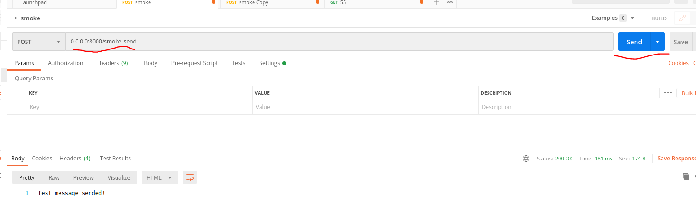
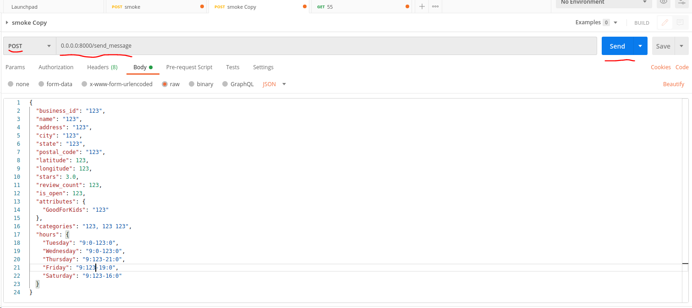
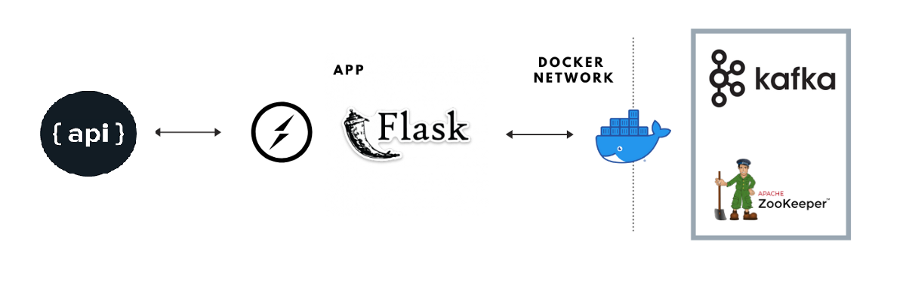

# stream-kafka 


Please make sure you have
local development environment for Python.

Then install the requirements listed in the [requirements.txt](requirements.txt) file:
```
pip install -r requirements.txt
```

Then make sure you have Docker and docker-compose tools installed on you computer.

```
docker --version && docker-compose --version
```

Starting project up:
```
docker-compose up
```
Is runs 3 containers: 
    
1) Flask producer server.

2) Kafka broker.

3) Zookeeper for kafka health checks and heartbeats.

To send some message follow screenshot below:

Sending smoke call to the APP

Sending data



To start consumer application you need to run the following command:
```
python consumer/manage.py [--consumer-timeout-ms 20000]
```

It just get all messages from last commit consume them, anonimize and put to ```data/persis/``` folder.


Putting architecture diagram here:
